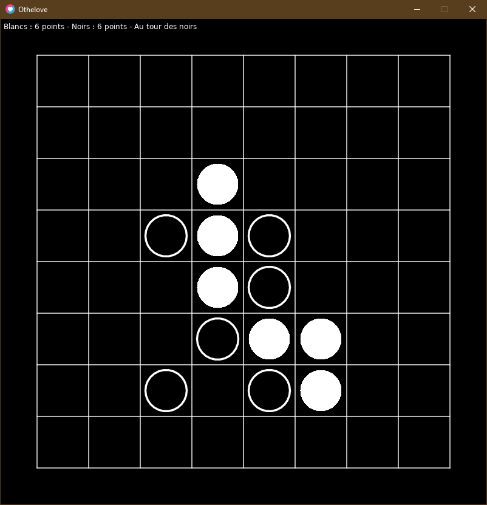

# Othelove

Othelove est un clone du jeu Revrsi réalisé en Lua.  
C'est surtout une expérience pour m'amuser et me détendre.

La police Cabin utilisée a été créé par [Pablo Impallari](https://www.dafont.com/fr/pablo-impallari.d2915)

